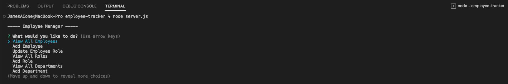
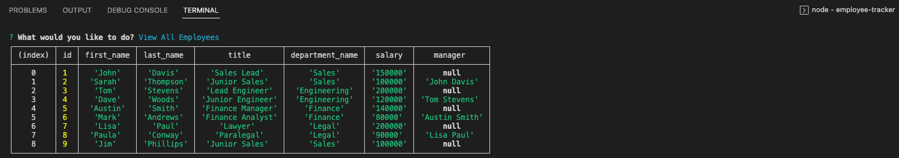
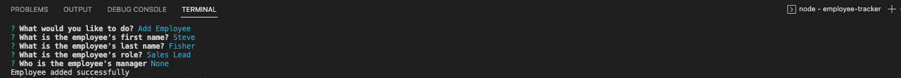

# Employee-Tracker

## Description
This application is an employee tracker. It was built using mysql, node, and javscript. 

## Installation
Ensure that you have node and mysql installed. Then, clone the repository into VSCode or some other coding application. Once inside the clone repository, navigate into the db folder and run "SOURCE schema.sql;" and press enter. Then run "SOURCE seeds.sql;" and press enter again. You can then quit sql and go back to the main folder where you will run "Node server.js" to start the application. 

## Usage
A user must clone the repository and navigate to the correct folder within the terminal. Once the sql commands have been run, type in "node server.js". The user will then be shown an employee manager with a list of questions of what you would like to do. 

You can navigate the questions to select what you want to view. The below image shows what comes up when you select "View All Employees".

There are also options to add employee, updated employee role, view all roles, add role, view departments, add department, or quit the application. The below image shows what it would look like if you selected add employee. The user would be prompted to add the first name, last name, role, and the manager. Once completed, the console will log "Employee added successfully". 

To quit the application, simply scroll down to the Quit option and click on that option. For further detail and an example of the entire application, please view the below video.

Walkthrough video:

[Employee Tracker](https://user-images.githubusercontent.com/121627491/232820160-f06d078a-ede3-4139-90c9-089252bf5bff.webm)

## Credits
https://www.w3schools.com/jsref/jsref_map.asphttps://www.w3schools.com/jsref/jsref_map.asp

## License
Please refer to the license in the repo.
